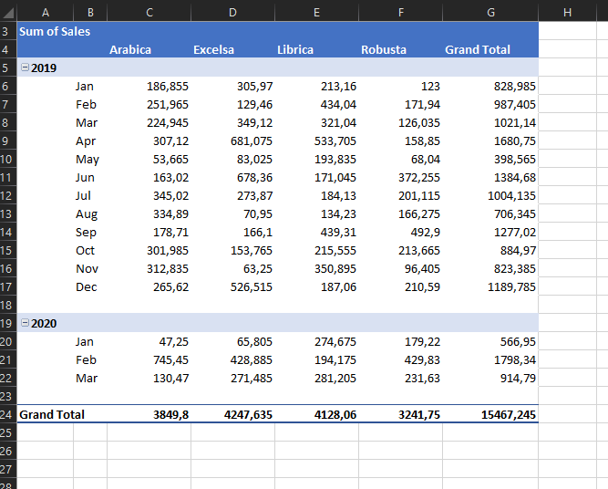
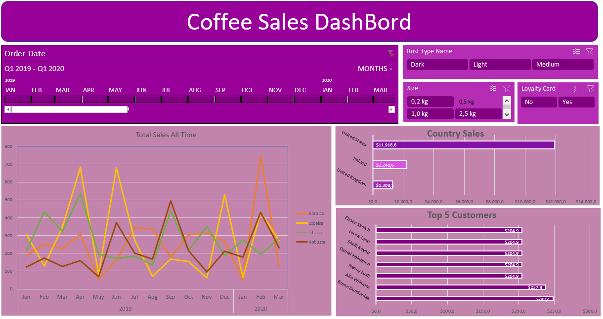
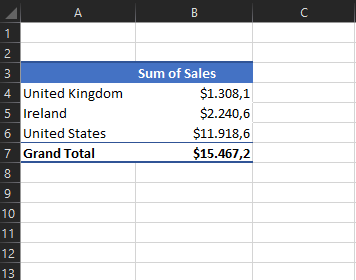
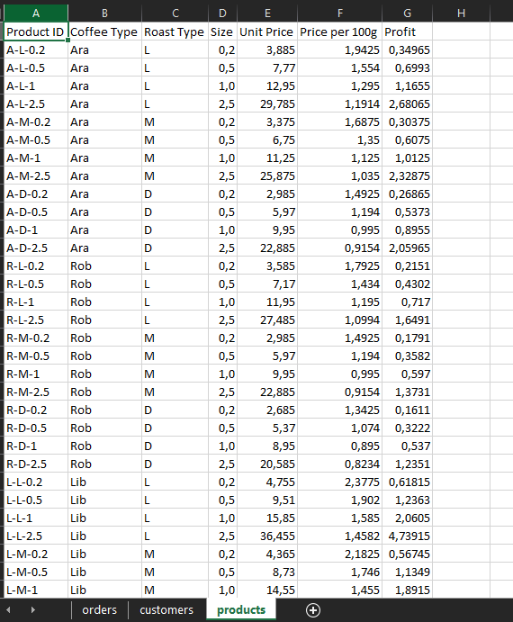
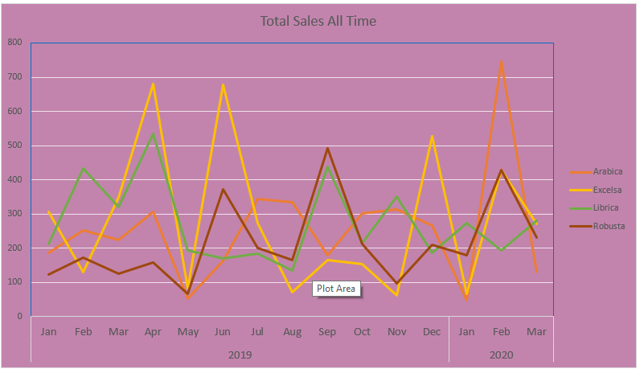

# ☕ Coffee Sales Analysis Dashboard  

This project is an **interactive Excel dashboard** that analyzes coffee sales data. The data was **cleaned, processed, and visualized** to gain insights into sales trends, top customers, and country-wise performance.  

## 📌 Steps Followed  

### 1️⃣ Data Cleaning & Preparation  

- **Removed duplicates** to ensure accuracy.  
- **Formatted date values** for consistency.  
- **Created new columns** in the **Orders** sheet:  
  - `Coffee Type`  
  - `Roast Type`  
  - `Size`  
  - `Unit Price`  
  - `Sales`  
  - `Coffee Type Name`  
  - `Roast Type Name`  
  - `Loyalty Card`  
- Used **XLOOKUP, INDEX-MATCH, IFS, and IF formulas** to pull relevant data from the **Customer** and **Product** sheets.  

📷 **Data Cleaning Example:**  
  

---

### 2️⃣ Data Analysis using Pivot Tables  

Created **pivot tables** to summarize key insights:  
- **Total Sales Overview**  
- **Sales by Country**  
- **Top 5 Customers by Sales**  
- **Sales Trends Over Time**  

📷 **Example Pivot Table:**  

 

---

### 3️⃣ Dashboard & Data Visualization  

Designed an **interactive dashboard** with visual insights:  
- **Bar Chart** for **Sales by Country**  
- **Bar Chart** for **Top 5 Customers**  
- **Line Chart** showing **Sales Trends for Coffee Types** (e.g., Arabica, Robusta, Excelsa, Liberica)  
- **Slicer for Coffee Type** to filter sales for specific types  
- **Time Selector** to analyze sales within a chosen timeframe  

📷 **Example Dashboard:**  

 

---

## 📸 Included Visuals  

This project includes multiple **pivot tables and charts** to make data insights more accessible.  

| Visual | Description |
|--------|------------|
|  | **Sales by Country** Pivot Table |
|  | **Total Sales Summary** |
|  | **Customer Insights** |
|  | **Product Information** |

---

## 🔍 Insights & Findings  

- **Which country has the highest sales?**  
- **Who are the top-performing customers?**  
- **Which coffee type is the most popular over time?**  
- **How does seasonality affect sales?**  

📷 **Example Sales Trend:**  
  

---

## 🚀 How to Use  

1. Open the **Excel dashboard**.  
2. Use the **slicers** to filter coffee types and timeframes.  
3. Analyze insights from the charts and pivot tables.  

---

### 📂 Files in the Repository  

- 📄 `README.md` → Project documentation  
- 📊 `DashBoard.png` → Final Dashboard View  
- 📊 `Country_pivot.png` → Sales by Country Pivot Table  
- 📊 `TotalSales_pivot.png` → Total Sales Summary  
- 📊 `Customer.png` → Customer Analysis  
- 📊 `Orders.png` → Processed Order Data  
- 📊 `Products.png` → Product Information  

---

### 🌟 Contributing  

If you have any suggestions for improvement, feel free to **open a pull request** or **submit an issue**!  

📬 **Contact:** [mohamedemamghanem@gamil.com]  

